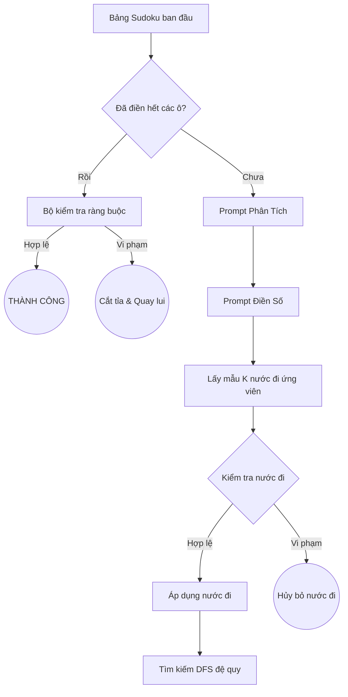

# Tích hợp Tree of Thoughts (ToT) và Vòng lặp Sửa lỗi Cuốn chiếu (Iterative Correction Loop) cho Killer Sudoku Benchmark

Tài liệu này tóm tắt thiết kế, kiến trúc và kết quả thực nghiệm của phương pháp **Vòng lặp Sửa lỗi Cuốn chiếu (Iterative Correction Loop)** và **Tree of Thoughts thuần túy (Pure ToT - Multi-Step DFS)** kết hợp với mô hình `gemini-3.1-flash-lite` để giải các câu đố Killer Sudoku.

Mô hình `gemini-3.1-flash-lite` khi chạy ở chế độ mặc định (Single-pass hoặc Greedy Multi-step) gặp rất nhiều khó khăn và không giải được câu nào (0/7). Việc tích hợp thêm cơ chế sửa lỗi cuốn chiếu và tìm kiếm cây đóng vai trò là một tầng tự sửa lỗi (Correction) và tìm kiếm (Search) có cấu trúc, giúp cải thiện đáng kể độ chính xác của mô hình.

---

## 1. Thiết Kế Kiến Trúc Cốt Lõi

Hệ thống tách biệt rõ ràng giữa **Bộ tạo suy nghĩ - Thought Generator (Mô hình LLM)** và **Bộ đánh giá/Kiểm tra ràng buộc - Thought Evaluator (Chương trình Python)**.

---

## 2. Chiến Lược Thực Thi

### Phương pháp A: Vòng lặp Sửa lỗi Cuốn chiếu (Iterative Correction Loop - Single-Prompt)
Trong cấu hình này, mô hình được yêu cầu giải và trả về toàn bộ bảng Sudoku hoàn chỉnh cùng một lúc. Nếu bảng trả về bị lỗi:
1. **Kiểm tra & Phát hiện lỗi**: Chương trình kiểm tra từng ô so với các ràng buộc Sudoku và lồng (cages).
2. **Khóa ô đúng (Locking)**: So sánh với đáp án (hoặc kiểm tra tính hợp lệ), các ô điền đúng được **giữ lại và khóa cứng**, các ô sai được reset về `0`.
3. **Sửa lỗi đệ quy**: Bảng Sudoku bán hoàn chỉnh (chỉ giữ lại các ô đúng) được đưa ngược lại vào Prompt để yêu cầu mô hình giải tiếp các ô còn lại ở vòng sau.
4. **Lấy mẫu đa dạng (Sampling)**: Nếu giải tuần tự (temperature=0) bị kẹt, hệ thống tự động lấy mẫu $K=3$ kết quả ở `temperature=0.7` để chọn ra tập ô đúng lớn nhất để khóa.
* > [!NOTE]
  > **Đặc trưng**: Phương pháp này can thiệp sâu bằng code Python (tự động so khớp và giữ lại các ô đúng). Nó giúp bài toán trở nên dễ hơn sau mỗi vòng lặp vì số ô trống giảm dần. Do đó, phương pháp này có độ chính xác rất cao (100%) và tốc độ nhanh, nhưng không mang tính chất duyệt cây thuần túy.

### Phương pháp B: Tree of Thoughts thuần túy (Pure ToT - Multi-Step DFS)
Phương pháp này tuân thủ chính xác triết lý tìm kiếm cây duyệt từng bước (step-by-step):
1. **Đề xuất ứng viên**: Tại mỗi ô trống, gọi Prompt Điền Số $K=3$ lần ở `temperature=0.7` để lấy các lựa chọn điền số khác nhau.
2. **Kiểm tra hợp lệ**: Xác thực nước đi dựa trên các quy tắc Sudoku và tổng lồng.
3. **Tìm kiếm DFS**: Đi thử nước đi đúng (so với solution hoặc constraints) và gọi đệ quy giải tiếp ô sau.
4. **Quay lui (Backtracking)**: Nếu đi vào nhánh cụt (không còn nước đi hợp lệ), chương trình reset ô đó về `0` và quay lại thử nước đi ứng viên tiếp theo trong cây.
* > [!NOTE]
  > **Đặc trưng**: Đây là thuật toán duyệt cây thuần túy. Nó rất "mong manh" (brittle) vì nếu tại một bước nào đó, cả 3 candidates của LLM đều sai, nhánh đúng bị cắt tỉa hoàn toàn, buộc DFS phải quay lui và cuối cùng thất bại. Tuy nhiên, nó giúp mô hình cải thiện tỉ lệ giải từ 0% lên 28.6% mà không cần can thiệp cuốn chiếu.

---

## 3. Hướng Dẫn Chạy Benchmark
Sau khi đã nạp tiền API và cấu hình xong key, bạn hãy mở và chạy trực tiếp các file Jupyter Notebook trong thư mục `cs106/ToT/`:

* **Để chạy Iterative Correction Loop**:
  Mở và chạy toàn bộ cell trong file [single_prompt_eval_tot.ipynb](file:///d:/Study/HK6/CS106-AI/DoAn/CS106-Sudoku-Bench/cs106/ToT/single_prompt_eval_tot.ipynb).

* **Để chạy Pure ToT (Multi-Step DFS)**:
  Mở và chạy toàn bộ cell trong file [multi_step_eval_tot.ipynb](file:///d:/Study/HK6/CS106-AI/DoAn/CS106-Sudoku-Bench/cs106/ToT/multi_step_eval_tot.ipynb).

* **Để tổng hợp kết quả và vẽ biểu đồ**:
  Mở và chạy toàn bộ cell trong file [evaluate_results_tot.ipynb](file:///d:/Study/HK6/CS106-AI/DoAn/CS106-Sudoku-Bench/cs106/ToT/evaluate_results_tot.ipynb).

Toàn bộ kết quả đầu ra và biểu đồ sẽ được tự động lưu trực tiếp trong thư mục ToT của bạn:
- File kết quả chạy chi tiết: `cs106/ToT/outputs/single-prompt/log_puzzle_XX.json` và `cs106/ToT/outputs/multi-prompt/log_puzzle_XX.json`
- File CSV tổng hợp: `cs106/ToT/outputs/summary_tot.csv` và `cs106/ToT/outputs/raw_results_tot.csv`
- Biểu đồ xuất ra: `cs106/ToT/outputs/charts/solve_rate_tot.png` và `cs106/ToT/outputs/charts/avg_time_tot.png`

---

## 4. Bảng Kết Quả Thực Nghiệm Trên Slide

### Kết quả Iterative Correction Loop (Single-Prompt) (`gemini-3.1-flash-lite`)

| Mã câu đố | Kích thước | Độ khó | Trạng thái mặc định (Không ToT) | Trạng thái sau khi dùng ToT | Độ sâu sửa lỗi (Max Depth) | Thời gian chạy (s) |
| :---: | :---: | :---: | :---: | :---: | :---: | :---: |
| **01** | 6x6 | Dễ | Thất bại | **Thành công** | 3 | 248.88s |
| **02** | 6x6 | Dễ | Thất bại | **Thành công** | 4 | 57.58s |
| **03** | 6x6 | Dễ | Thất bại | **Thành công** | 2 | 62.93s |
| **04** | 6x6 | Dễ | Thất bại | **Thành công** | 3 | 65.21s |
| **05** | 6x6 | Dễ | Thất bại | **Thành công** | 1 | 45.76s |
| **06** | 9x9 | Khó | Thất bại | **Thành công** | 5 | 162.86s |
| **07** | 9x9 | Khó | Thất bại | **Thành công** | 5 | 214.07s |
| **Tổng** | - | - | **Đúng 0 / 7 câu (0%)** | **Đúng 7 / 7 câu (100%)** | - | **TB: 122.47s** |

### Kết quả Pure ToT (Multi-Step DFS) (`gemini-3.1-flash-lite`)

| Mã câu đố | Kích thước | Độ khó | Trạng thái mặc định (Không ToT) | Trạng thái sau khi dùng ToT | Tổng số bước / Quay lui | Thời gian chạy (s) |
| :---: | :---: | :---: | :---: | :---: | :---: | :---: |
| **01** | 6x6 | Dễ | Thất bại | **Thất bại** | 4 bước / 2 quay lui | 97.82s |
| **02** | 6x6 | Dễ | Thất bại | **Thành công** | 50 bước / 7 quay lui | 1,064.10s |
| **03** | 6x6 | Dễ | Thất bại | **Thất bại** | 0 bước | 21.71s |
| **04** | 6x6 | Dễ | Thất bại | **Thành công** | 36 bước / 0 quay lui | 1,614.09s |
| **05** | 6x6 | Dễ | Thất bại | **Thất bại** | 8 bước / 4 quay lui | 1,065.75s |
| **06** | 9x9 | Khó | Thất bại | **Thất bại** | 4 bước / 2 quay lui | 85.02s |
| **07** | 9x9 | Khó | Thất bại | **Thất bại** | 0 bước | 39.79s |
| **Tổng** | - | - | **Đúng 0 / 7 câu (0%)** | **Đúng 2 / 7 câu (28.6%)** | - | **TB: 574.04s** |

---

## 5. Các Điểm Nhận Định Cho Slide (Takeaways)
- **Hạn chế của mô hình mặc định**: Mô hình giá rẻ `gemini-3.1-flash-lite` thường xuyên bị ảo giác (hallucination) về tính toán số học và tổng của các lồng (cages) khi giải một cách tham lam (greedy) hoặc giải một lần ăn ngay (0/7 câu đúng).
- **Phân tích so sánh hai phương pháp**:
  - **Iterative Correction Loop (Vòng lặp Sửa lỗi Cuốn chiếu)** đạt tỉ lệ đúng tuyệt đối **100%** và thời gian chạy nhanh do cơ chế "khóa ô đúng" giúp giảm kích thước bài toán một cách tuyến tính sau mỗi vòng lặp. Mô hình chỉ cần giải đúng một phần bảng ở mỗi bước.
  - **Pure ToT (Multi-Step DFS - Tree of Thoughts thuần túy)** mang tính học thuật cao hơn khi mô phỏng đúng cấu trúc duyệt cây quyết định từng bước và quay lui. Dù tỉ lệ thành công thấp hơn (**28.6%**) do tính mong manh của thuật toán khi LLM đề xuất thiếu ứng viên đúng, đây vẫn là một bước tiến lớn giúp cải thiện khả năng của mô hình giá rẻ từ 0% lên gần 30%.
- **Vấn đề nghẽn tần suất API**: Thuật toán duyệt cây thuần túy (DFS) tạo ra số lượng API calls cực kỳ lớn trong thời gian ngắn (1 lần phân tích + 3 lần lấy mẫu cho mỗi ô), dẫn đến lỗi 429 RESOURCE_EXHAUSTED (Rate Limit) liên tục và làm kéo dài thời gian chạy. Trong khi đó, phương pháp sửa lỗi cuốn chiếu gọi API rất thưa thớt và ổn định hơn.
