# Nội Dung Slide Báo Cáo CS106 - Sudoku-Bench

File này là bản nội dung chi tiết để copy-paste vào Canva/PowerPoint.  
Không có phần lời thoại. Nếu một slide quá dài, có thể tự tách thành 2 slide cùng tiêu đề.

Quy định mới:

- 20-25 phút trình bày slide + demo.
- 5-10 phút vấn đáp.
- Nếu demo/thực nghiệm chưa hoàn tất, có thể quay video bổ sung trước 21/06.
- Sau báo cáo, nhóm chỉnh slide/demo theo góp ý của GV và nộp lại trước 21/06.

Ghi chú trạng thái kết quả:

- Benchmark 6x6 hiện có 5 puzzle easy.
- Nhóm đã benchmark trên 4 model:
  - Gemini 2.5 Flash;
  - Gemini 2.5 Pro;
  - Gemini 3.1 Flash Lite;
  - Gemini 3.5 Flash.
- 6x6: 5 puzzle easy, đã có kết quả single-prompt và multi-step cho đủ 4 model.
- 9x9: 2 puzzle hard, đã có kết quả single-prompt và multi-step cho đủ 4 model.
- Kết quả tổng quát:
  - 6x6 single-prompt: Gemini 2.5 Pro và Gemini 3.5 Flash đạt 5/5.
  - 6x6 multi-step: Gemini 3.5 Flash đạt 5/5.
  - 9x9 single-prompt: chỉ Gemini 3.5 Flash giải được 1/2.
  - 9x9 multi-step: Gemini 2.5 Pro và Gemini 3.5 Flash đều đạt 2/2.
- Evaluation notebook và biểu đồ nằm trong `cs106/evaluation`.

---

# Slide 1. Trang Bìa

**ĐÁNH GIÁ KHẢ NĂNG SUY LUẬN RÀNG BUỘC CỦA LLM THÔNG QUA SUDOKU-BENCH**

Môn học: CS106 - Trí tuệ nhân tạo  
Giảng viên hướng dẫn: Lương Ngọc Hoàng  
Nhóm thực hiện: Nhóm 4  
Thời gian thực hiện: 05/2026

Thành viên:

- Đặng Anh Khoa
- Phạm Minh Bảo Khang
- Nguyễn Khang Hy
- Phan Công Nam

Media:

- Logo UIT.
- Nền lưới Sudoku/Killer Sudoku.
- Có thể thêm ảnh minh họa cage Sudoku mờ phía sau.

---

# Slide 2. Table Of Contents

**Nội dung trình bày theo các phần lớn**

1. **Vấn đề nghiên cứu và paper tham chiếu**
   - Vấn Đề Nghiên Cứu
   - Câu Hỏi Nghiên Cứu
   - Paper Tham Chiếu
   - Vì Sao Chọn Sudoku-Bench?

2. **Cơ sở lý thuyết**
   - Constraint Reasoning Trong Sudoku-Bench
   - Dataset Và Text Representation Của Paper
   - Sudoku Variants
   - Killer Sudoku
   - Break-In
   - Vì Sao Sudoku Variants Khó Với LLM?

3. **Thiết kế đánh giá và phạm vi tái hiện**
   - Thiết Kế Đánh Giá Của Paper
   - Chỉ Số Đánh Giá
   - Phạm Vi Tái Hiện Của Nhóm
   - Vì Sao Không Chạy Toàn Bộ Benchmark?

4. **Pipeline thực nghiệm của nhóm**
   - Dataset
   - Pipeline Tổng Quát
   - Single-Prompt Evaluation
   - Multi-Step Evaluation
   - Định Dạng Output Multi-Step
   - Killer Sudoku Cheat Sheet
   - Validator

5. **Kết quả và phân tích**
   - Kết Quả Single-Prompt 6x6 Hiện Tại
   - Chi Tiết Single-Prompt 6x6
   - Kết Quả Single-Prompt 9x9
   - Kết Quả Multi-Step 6x6 Hiện Tại
   - Chi Tiết Multi-Step 6x6
   - Kết Quả Multi-Step 9x9
   - So Sánh Single-Prompt Và Multi-Step
   - Ví Dụ Single-Prompt Fail
   - Ví Dụ Multi-Step Thành Công
   - Phân Tích Lỗi
   - Vì Sao 9x9 Khó Hơn?
   - So Sánh Với Paper Gốc

6. **Demo, kết luận và hướng phát triển**
   - Demo Web
   - Hạn Chế Của Đồ Án
   - Hướng Phát Triển
   - Kết Luận

Media:

- Dùng timeline ngang 6 phần theo đúng thứ tự ở trên.
- Có thể đặt icon cho từng phần: research question, theory, benchmark design, pipeline, results, demo/conclusion.

---

# Slide 3. Vấn Đề Nghiên Cứu

**LLM có thật sự suy luận logic, hay chỉ đang nhận diện mẫu?**

Các mô hình ngôn ngữ lớn hiện nay thể hiện năng lực rất mạnh trong nhiều tác vụ:

- trả lời câu hỏi tự nhiên;
- sinh văn bản;
- hỗ trợ lập trình;
- giải thích kiến thức;
- thực hiện các bài toán ngắn có dạng quen thuộc.

Tuy nhiên, với các bài toán logic có ràng buộc chặt, yêu cầu không chỉ là "nghe hợp lý" mà phải **đúng tuyệt đối**.

Trong các bài toán suy luận ràng buộc:

- mỗi bước đi phải thỏa tất cả ràng buộc liên quan;
- một lựa chọn sai có thể làm toàn bộ trạng thái sau đó sai;
- lời giải cuối cùng cần được kiểm tra bằng nghiệm chuẩn;
- reasoning bằng ngôn ngữ tự nhiên chưa đủ để đảm bảo đáp án đúng.

Thông điệp của slide:

> LLM có thể giải thích rất thuyết phục, nhưng bài toán ràng buộc cần một cơ chế kiểm chứng hình thức.

Media:

| Pattern Matching | Constraint Reasoning |
|---|---|
| Dựa vào mẫu quen thuộc | Dựa vào luật và ràng buộc |
| Câu trả lời có thể nghe hợp lý | Câu trả lời phải đúng hình thức |
| Khó phát hiện sai nếu không có ground truth | Có thể validate tự động |
| Phù hợp với tác vụ ngôn ngữ | Phù hợp với Sudoku, lập lịch, bài toán ràng buộc |

---

# Slide 4. Câu Hỏi Nghiên Cứu

**Nhóm tập trung trả lời các câu hỏi sau**

1. LLM có thể đọc hiểu và áp dụng luật của Sudoku variants không?
2. LLM có duy trì được tính nhất quán toàn cục khi có nhiều ràng buộc giao nhau không?
3. Single-prompt và multi-step khác nhau như thế nào về kết quả và khả năng phân tích lỗi?
4. Khi tăng kích thước từ 6x6 lên 9x9, độ khó và chi phí thay đổi ra sao?
5. Việc bổ sung prompt context như Killer Sudoku cheat sheet có giúp mô hình ổn định hơn không?

Kỳ vọng của nhóm:

- Không chỉ chạy LLM để lấy đáp án.
- Cần có pipeline tự động để đọc đề, gọi model, parse kết quả và validate.
- Cần có log để biết mô hình sai ở đâu, thay vì chỉ biết đáp án cuối đúng hay sai.

Media:

Checklist 5 câu hỏi nghiên cứu.

---

# Slide 5. Paper Tham Chiếu

**Paper gốc: Sudoku-Bench**

**Sudoku-Bench: Evaluating Creative Reasoning with Sudoku Variants**  
Sakana AI, 2025

Mục tiêu của paper:

- đánh giá năng lực creative reasoning của LLM;
- dùng Sudoku variants thay vì Sudoku chuẩn;
- yêu cầu mô hình đọc luật mới và áp dụng vào từng puzzle;
- giảm khả năng mô hình chỉ dựa vào mẫu Sudoku quen thuộc;
- đánh giá bằng nghiệm chuẩn và phân tích lỗi.

Điểm quan trọng:

- Paper không chỉ hỏi "model có trả lời được không?".
- Paper kiểm tra việc mô hình có thể **suy luận dưới các ràng buộc mới** hay không.
- Sudoku variants có vai trò như một môi trường kiểm tra reasoning có luật rõ ràng.

Media:

- Ảnh trang đầu paper.
- Ảnh trích từ paper:
  - 
- Citation box:

```text
Sudoku-Bench: Evaluating Creative Reasoning with Sudoku Variants
Sakana AI, 2025
```

---

# Slide 6. Vì Sao Chọn Sudoku-Bench?

**Sudoku-Bench phù hợp với yêu cầu đồ án CS106**

Lý do chọn:

- Có bài báo khoa học cụ thể làm reference.
- Có liên hệ trực tiếp với suy luận ràng buộc trong Trí tuệ nhân tạo.
- Có thực nghiệm rõ ràng để tái hiện một phần.
- Có thể xây dựng pipeline đánh giá tự động.
- Có thể phân tích lỗi của LLM dựa trên ground truth.

Điểm mạnh của Sudoku variants:

- luật chơi rõ ràng;
- nghiệm có thể kiểm chứng;
- không gian ràng buộc phong phú;
- dễ minh họa trong slide và demo;
- phù hợp để so sánh single-prompt và multi-step.

Thông điệp:

> Sudoku-Bench là cầu nối tốt giữa lý thuyết suy luận ràng buộc và đánh giá thực nghiệm LLM.

---

# Slide 7. Constraint Reasoning Trong Sudoku-Bench

**Sudoku-Bench dùng Sudoku variants để kiểm tra suy luận ràng buộc**

Trong đồ án này, nhóm không xây dựng một solver ràng buộc truyền thống.
Nhóm dùng góc nhìn ràng buộc để giải thích vì sao Sudoku variants là một benchmark tốt cho LLM.

Một puzzle Sudoku variant có:

- **ô cần điền:** các vị trí trên lưới;
- **miền giá trị:** các chữ số hợp lệ;
- **ràng buộc chuẩn:** hàng, cột, vùng không lặp số;
- **ràng buộc biến thể:** cage sum, arrow, thermometer, knight move, v.v.;
- **nghiệm chuẩn:** dùng để validate tự động.

Điểm quan trọng với LLM:

- model phải đọc luật được mô tả bằng ngôn ngữ tự nhiên;
- model phải duy trì nhiều ràng buộc cùng lúc;
- một đáp án nghe hợp lý vẫn có thể sai hình thức;
- vì vậy cần validator thay vì chỉ tin vào reasoning text.

Thông điệp:

> Góc nhìn ràng buộc là nền giải thích; trọng tâm của nhóm là tái hiện benchmark Sudoku-Bench để đánh giá reasoning của LLM.

---

# Slide 8. Dataset Và Text Representation Của Paper

**Paper chuẩn hóa puzzle để model xử lý bằng text**

Sudoku-Bench không yêu cầu model nhìn ảnh puzzle trực tiếp.
Paper chuyển puzzle sang dạng text gồm:

- luật chung của Sudoku;
- luật riêng của từng variant;
- kích thước lưới;
- tọa độ các ô;
- mô tả các ràng buộc đặc biệt;
- yêu cầu output có thể kiểm chứng.

Phạm vi paper:

| Thành phần | Paper gốc |
|---|---|
| Core benchmark | `challenge_100` |
| Số puzzle chính | 100 Sudoku variants |
| Kích thước | 4x4, 6x6, 9x9 |
| Kiểu đánh giá | single-shot và multi-step |
| Metric | solve rate, correct placements, error type |

Ý nghĩa với nhóm:

- nhóm tái hiện rút gọn thay vì chạy toàn bộ 100 puzzle;
- nhóm dùng JSON riêng để lưu grid, cages, solution;
- nhưng tinh thần vẫn giống paper: puzzle text/structured input -> LLM -> parser -> validator.

Media:

- Dùng Figure 3 trong paper để minh họa text representation:
  - 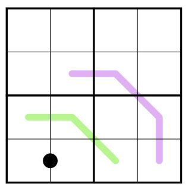

---

# Slide 9. Sudoku Variants

**Sudoku variants thêm ràng buộc mới vào Sudoku chuẩn**

Một số biến thể phổ biến:

| Variant | Ràng buộc bổ sung |
|---|---|
| Knight's Move | Các ô cách nhau như nước đi quân mã không được trùng số |
| Arrow | Tổng các ô trên thân mũi tên bằng số ở vòng tròn gốc |
| Thermometer | Các số tăng dần dọc theo nhiệt kế |
| Killer Cage | Tổng các ô trong cage bằng một giá trị cho trước |

Vì sao variants khó hơn Sudoku chuẩn?

- Một ô chịu nhiều loại ràng buộc cùng lúc.
- Có nhiều ràng buộc cục bộ nhưng ảnh hưởng toàn cục.
- Bước đầu không phải lúc nào cũng hiển nhiên.
- Cần tìm "điểm mở khóa" để bắt đầu suy luận.

Thông điệp:

> Sudoku variants làm lộ rõ hơn năng lực suy luận ràng buộc của mô hình.

Media:

- Ảnh Figure 1 từ paper, minh họa nhiều Sudoku variants có luật riêng:
  - 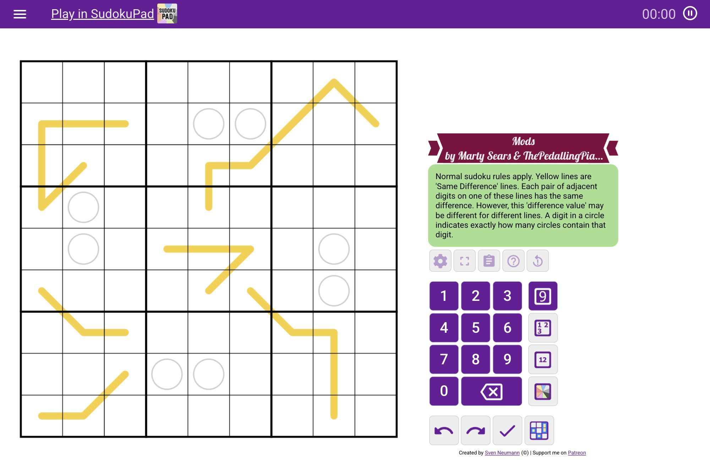
  - 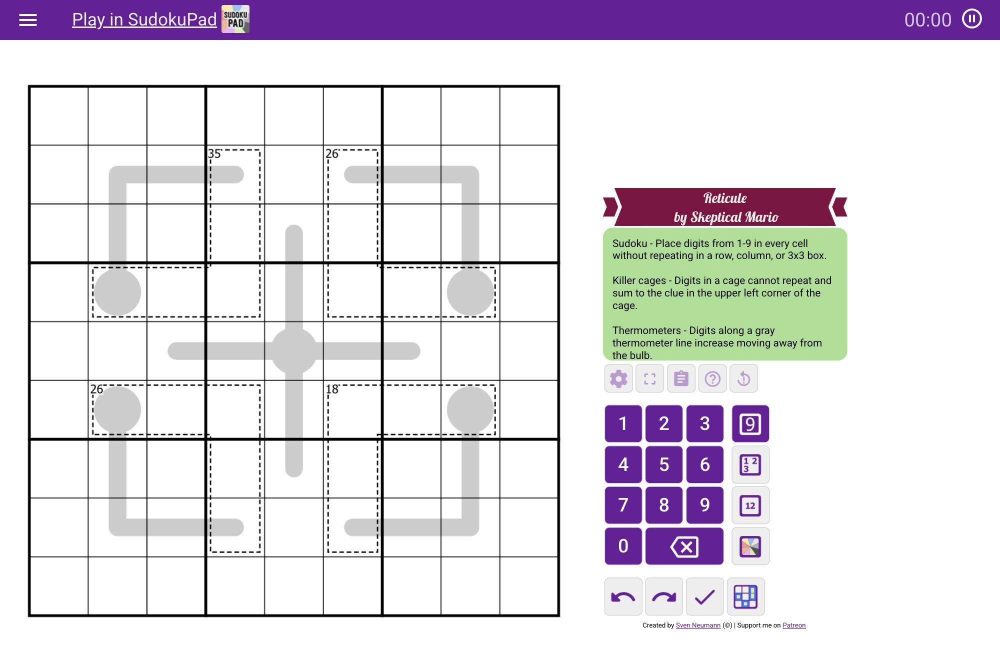
  - 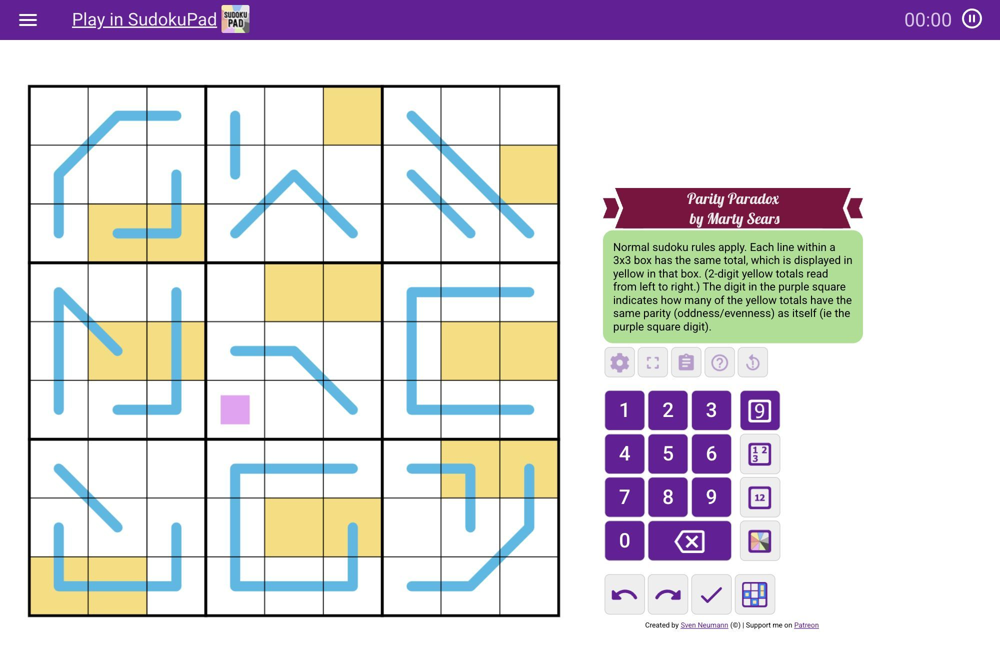
  - 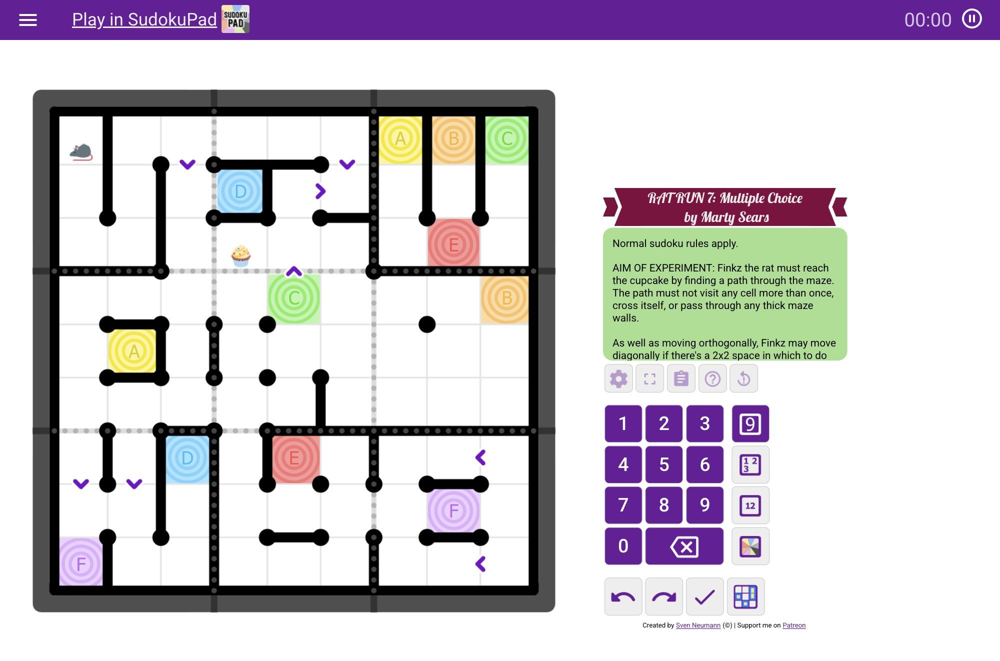
  - 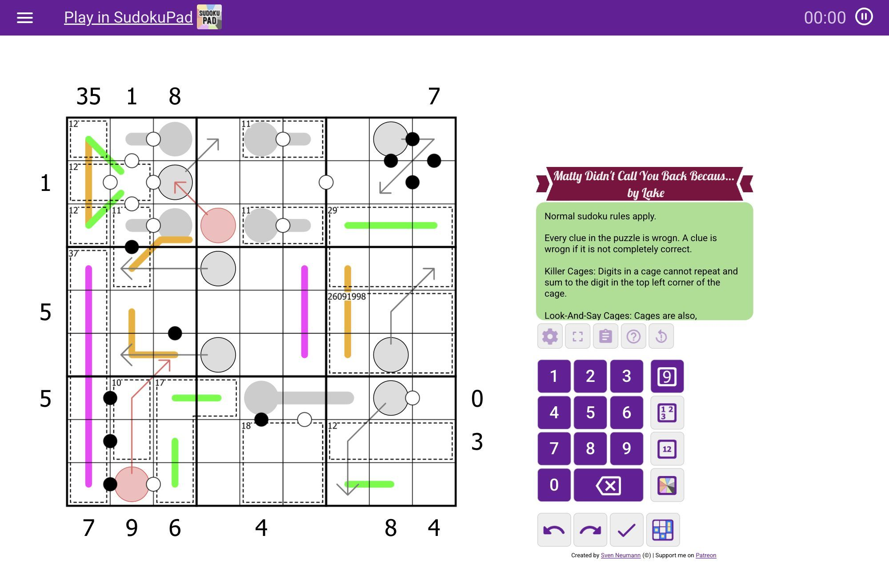

Gợi ý dùng trong slide:

- Chọn 2-3 ảnh nổi bật, không cần đưa cả 5 ảnh lên cùng một slide.
- Caption: "Figure 1 trong paper: mỗi Sudoku variant có một bộ luật riêng được mô tả bằng ngôn ngữ tự nhiên."

---

# Slide 10. Killer Sudoku

**Biến thể nhóm chọn: Killer Sudoku**

Killer Sudoku = Sudoku chuẩn + ràng buộc cage.

Mỗi cage gồm:

- một nhóm ô;
- một tổng mục tiêu;
- điều kiện tổng các ô bằng tổng mục tiêu;
- điều kiện các số trong cage không được lặp.

Ví dụ:

```text
Cage: r1c1 + r2c1 = 3
Digits allowed in 6x6: 1..6
Possible combination: {1,2}
```

Tuy nhiên:

- biết cage là `{1,2}` chưa đủ;
- cần xác định ô nào là 1, ô nào là 2;
- phải kết hợp với hàng, cột, khối và các cage khác.

Media:

- Hình một bảng Killer Sudoku.
- Highlight một cage và ghi target sum.
- Có thể dùng ảnh Figure 5 trong paper nếu muốn minh họa puzzle 6x6:
  - 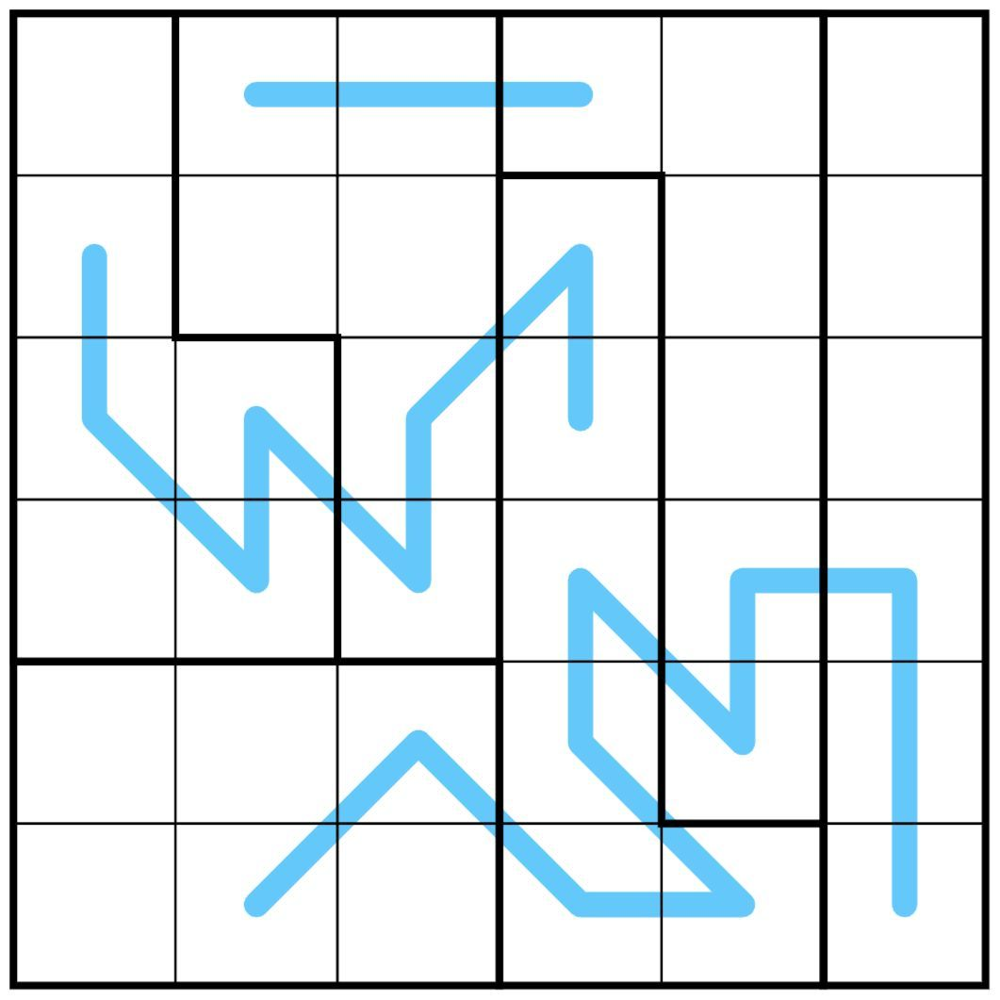

---

# Slide 11. Break-In

**Break-in: điểm mở khóa lời giải**

Trong nhiều Sudoku variants:

- không thể bắt đầu bằng cách nhìn một ô đơn giản;
- cần phát hiện một ràng buộc then chốt;
- sau bước mở khóa, các ràng buộc khác bắt đầu lan truyền;
- người giải phải biết nên bắt đầu từ đâu.

Break-in trong bối cảnh LLM:

- kiểm tra khả năng chọn hướng suy luận;
- kiểm tra khả năng kết hợp nhiều luật;
- kiểm tra việc mô hình có thể tạo ra một bước đi chắc chắn thay vì đoán.

Flow:

```text
Puzzle ban đầu
    ↓
Nhiều khả năng còn mở
    ↓
Tìm break-in
    ↓
Thu hẹp ứng viên
    ↓
Điền các ô tiếp theo
```

Media:

- Ảnh Figure 2 từ paper về puzzle Ascension và break-in:
  - 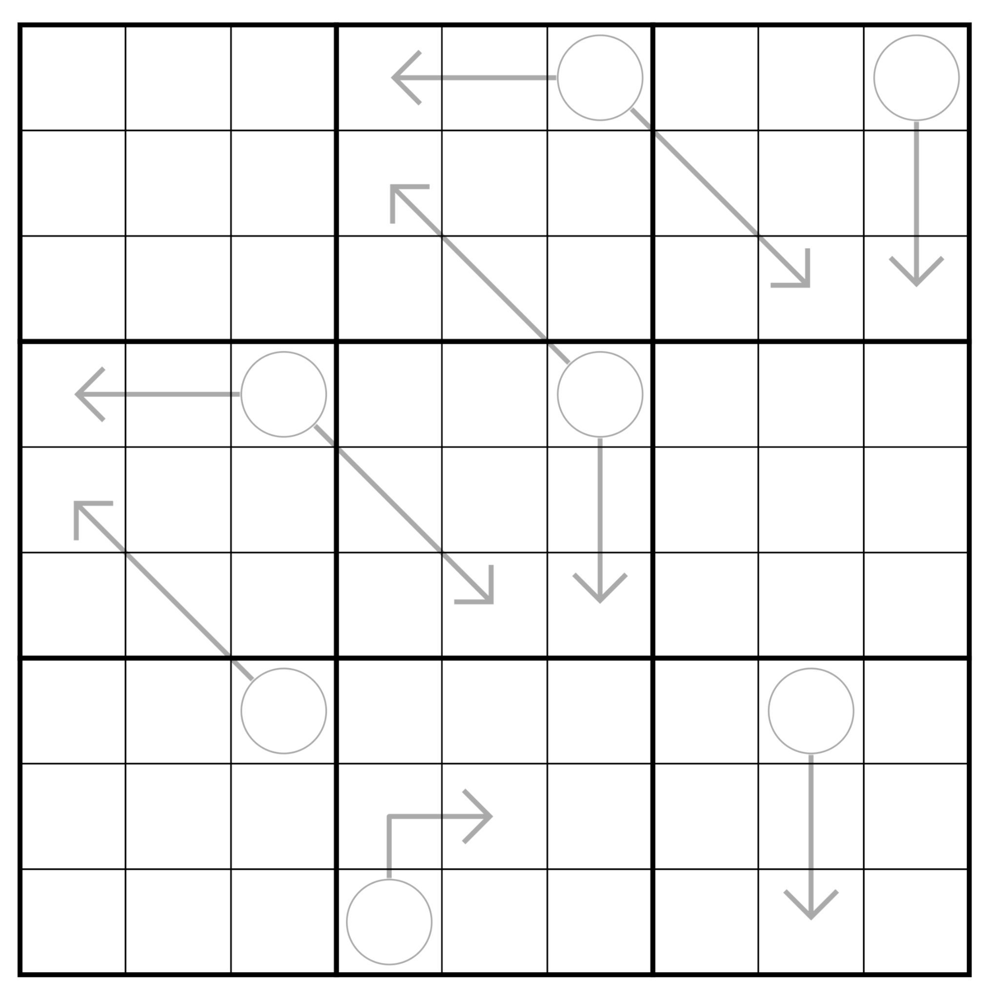
  - 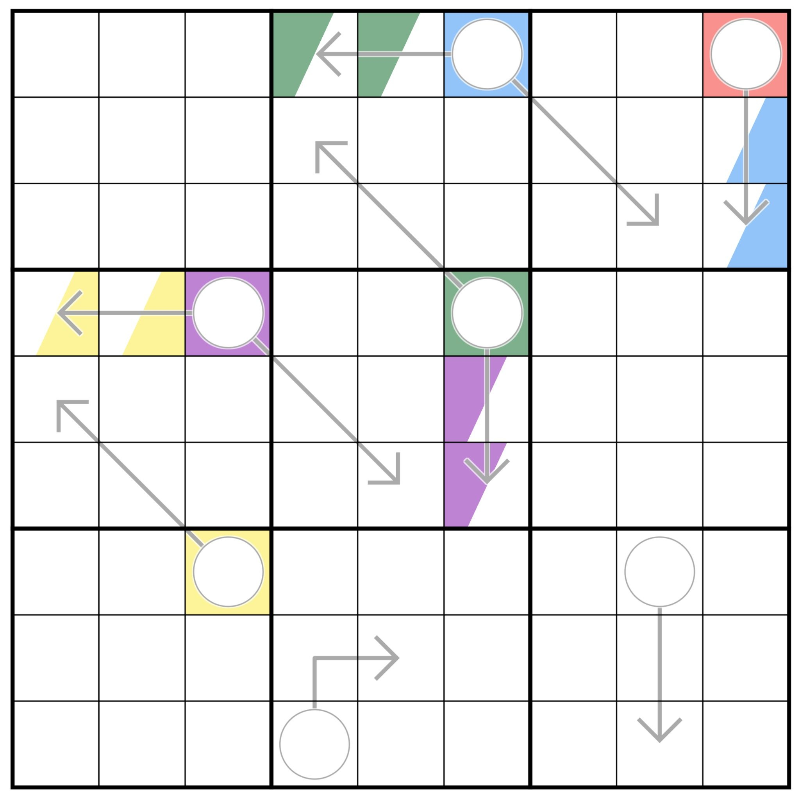
  - 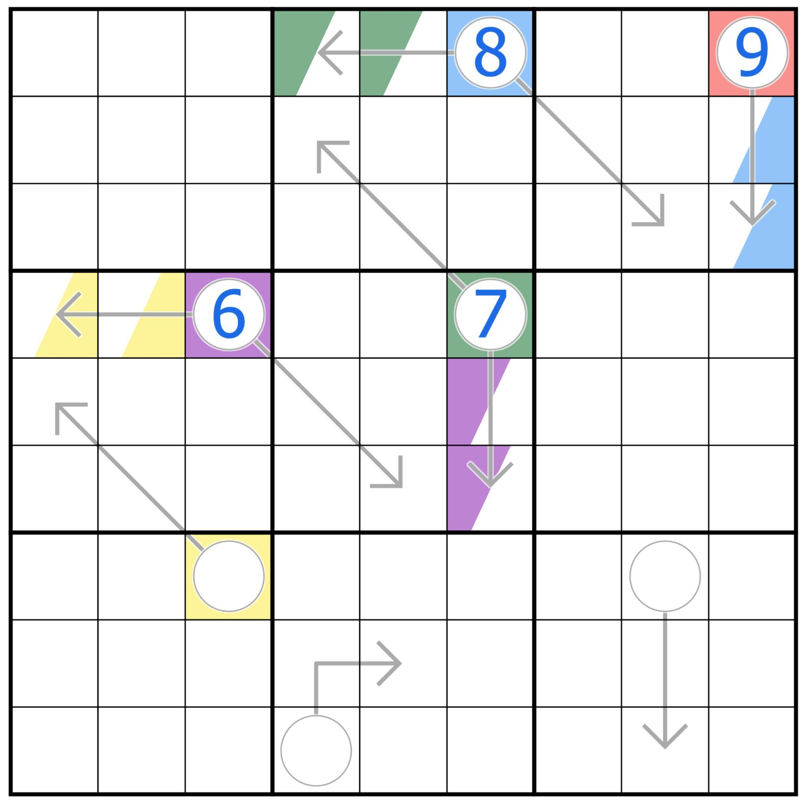
  - 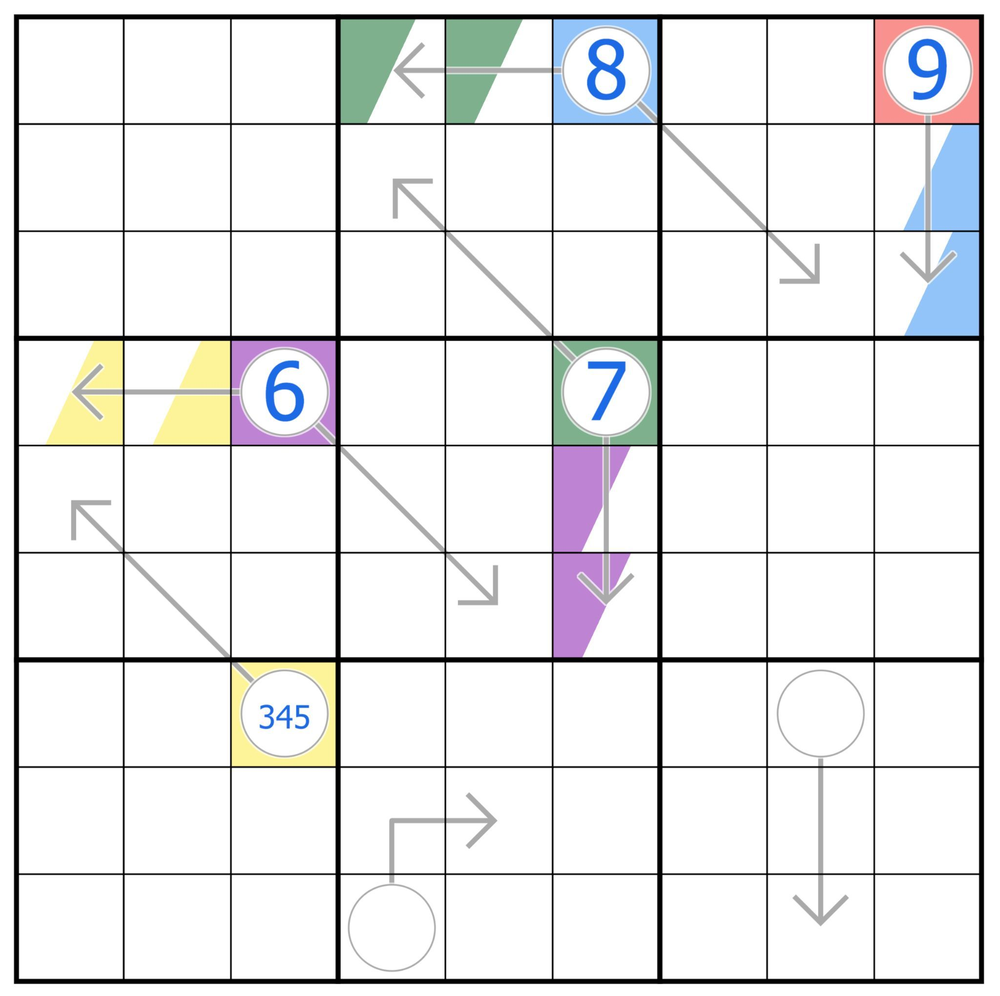
- Gợi ý dùng 2 ảnh: initial board và highlighted/break-in board.
- Caption: "Figure 2 trong paper: ví dụ break-in từ puzzle Ascension."

---

# Slide 12. Vì Sao Sudoku Variants Khó Với LLM?

**Những hạn chế thường gặp của LLM khi giải Sudoku variants**

1. **Khó duy trì trạng thái toàn cục**
   - Board có nhiều ô.
   - Mỗi ô liên quan tới nhiều ràng buộc.
   - Context dài dễ làm mô hình bỏ sót thông tin.

2. **Khó quay lui**
   - LLM sinh câu trả lời tuần tự.
   - Khi đã chọn sai, các bước sau dễ dựa trên trạng thái sai.

3. **Reasoning tự nhiên không đảm bảo đúng hình thức**
   - Lời giải thích có thể nghe hợp lý.
   - Nhưng chỉ cần sai một ràng buộc là đáp án fail.

4. **Dễ nhầm giữa "có thể" và "bắt buộc"**
   - Một giá trị là ứng viên chưa chắc là đáp án.
   - Sudoku variants yêu cầu bước đi phải được chứng minh chắc chắn.

Thông điệp:

> Với Sudoku-Bench, validator quan trọng không kém prompt.

---

# Slide 13. Thiết Kế Đánh Giá Của Paper

**Hai chế độ đánh giá chính**

| Tiêu chí | Single-shot / Single-prompt | Multi-step |
|---|---|---|
| Cách gọi model | Một lần cho toàn bộ puzzle | Nhiều vòng tương tác |
| Output | Grid hoàn chỉnh | Một bước đi mỗi vòng |
| Chi phí API | Thấp hơn | Cao hơn nhiều |
| Phân tích quá trình | Hạn chế | Chi tiết hơn |
| Biết bước sai đầu tiên | Khó | Có |

Single-shot phù hợp để kiểm tra:

- khả năng giải trực tiếp;
- chất lượng prompt tổng quát;
- chi phí thấp.

Multi-step phù hợp để kiểm tra:

- quá trình suy luận;
- khả năng duy trì trạng thái;
- lỗi xuất hiện ở bước nào.

Media:

- Có thể chèn bảng leaderboard của paper để minh họa cách paper báo cáo multi-step và single-shot:
  - trích nội dung từ `documents/paper.md`, đoạn Table 1.
- Nếu muốn dùng ảnh trực tiếp từ paper, chụp/cắt trang chứa Table 1 từ PDF.
- Caption gợi ý: "Paper đánh giá bằng cả multi-step solve rate và single-shot solve rate, phân theo kích thước puzzle."

---

# Slide 14. Chỉ Số Đánh Giá

**Các chỉ số nhóm sử dụng**

1. **Solve Rate**
   - Tỷ lệ puzzle được giải đúng hoàn toàn.

2. **Final Status**
   - Success hoặc Failed.

3. **Error Type**
   - Incorrect Solution;
   - No Certain Move;
   - Surrender;
   - Claimed Contradiction;
   - Missing Information.

4. **Correct Placements**
   - Áp dụng cho multi-step.
   - Cho biết mô hình điền đúng được bao nhiêu ô trước khi solve hoặc fail.
   - Đây là metric gần với `multi-step correct placements` trong paper.

5. **Number of Steps**
   - Áp dụng cho multi-step.
   - Cho biết mô hình đi được bao lâu trước khi thành công hoặc thất bại.

6. **Execution Time**
   - Áp dụng cho single-prompt output.
   - Cho biết thời gian gọi API và xử lý.

7. **Execution Log**
   - Lưu reasoning, ô được chọn, giá trị điền và board state.

Media:

- Có thể dùng Figure 4 từ paper để minh họa error categorization trong single-shot:
  - 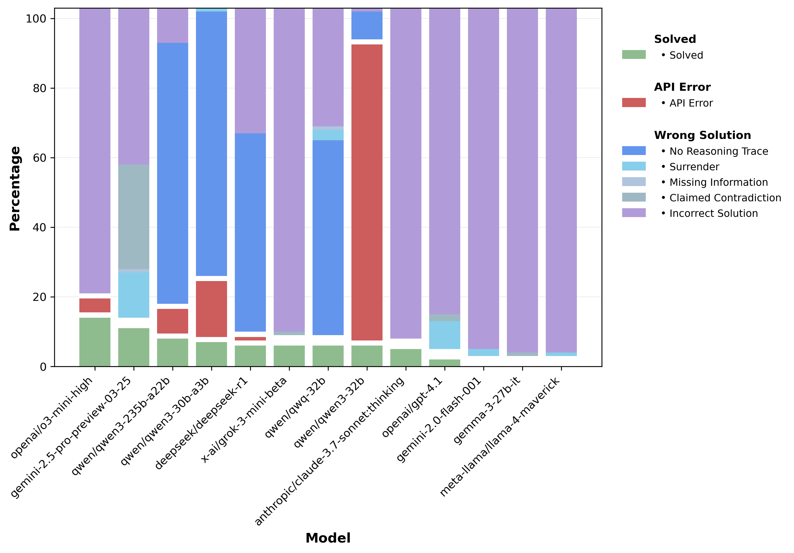
- Caption: "Figure 4 trong paper: phân loại phản hồi ở single-shot theo đúng/sai và loại lỗi."

---

# Slide 15. Phạm Vi Tái Hiện Của Nhóm

**Nhóm tái hiện rút gọn Sudoku-Bench**

Nhóm không tái hiện toàn bộ benchmark gốc, mà tập trung vào phạm vi phù hợp với đồ án:

- biến thể chính: **Killer Sudoku**;
- model benchmark hiện tại:
  - Gemini 2.5 Flash;
  - Gemini 2.5 Pro;
  - Gemini 3.1 Flash Lite;
  - Gemini 3.5 Flash;
- chế độ đánh giá:
  - single-prompt;
  - multi-step;
- dataset hiện tại:
  - 5 puzzle 6x6 easy;
  - 2 puzzle 9x9 hard;
- 6x6 đã chạy trên 4 model với cả single-prompt và multi-step;
- 9x9 đã chạy đủ 4 model với cả single-prompt và multi-step;
- kết quả được tổng hợp bằng notebook evaluation riêng trong `cs106/evaluation`.

Lý do chọn phạm vi rút gọn:

- giới hạn thời gian;
- giới hạn chi phí API;
- multi-step cần rất nhiều lượt gọi model, đặc biệt khi mở rộng lên 4 model và 2 map 9x9;
- đồ án yêu cầu có thực nghiệm, không bắt buộc tái hiện 100% paper.

Kết quả cuối cho thấy phạm vi rút gọn vẫn đủ tạo khác biệt:

- 6x6 easy phân biệt được model mạnh/yếu;
- 9x9 hard phân biệt rõ single-prompt và multi-step;
- multi-step giúp model mạnh giải được 9x9, trong khi single-prompt hầu hết thất bại.

---

# Slide 16. Vì Sao Không Chạy Toàn Bộ Benchmark?

**Chi phí multi-step tăng rất nhanh**

Trong multi-step hiện tại:

- mỗi ô thường có 2 lượt gọi LLM:
  - một lượt analysis;
  - một lượt fill;
- nếu điền sai thì dừng;
- nếu điền đúng đến cuối, số lượt gọi tăng theo số ô.

Ước lượng:

| Kích thước | Số ô | Số lượt gọi tối đa |
|---:|---:|---:|
| 6x6 | 36 | 72 |
| 9x9 | 81 | 162 |

Nếu chạy nhiều puzzle và nhiều model:

```text
Tổng chi phí ≈ số puzzle × số model × số ô × 2 lượt gọi
```

Kết luận:

> Nhóm ưu tiên chạy tập nhỏ nhưng có log, validator và phân tích rõ.

---

# Slide 17. Dataset

**Cấu trúc dữ liệu đầu vào**

Mỗi puzzle được lưu trong file JSON:

```json
{
  "id": 1,
  "difficulty": "easy",
  "grid_size": 6,
  "puzzle": [[0,0,0,0,0,0], ...],
  "solution": [[1,3,5,2,6,4], ...],
  "cages": [
    {"cells": [[0,0],[1,0]], "sum": 3}
  ]
}
```

Ý nghĩa các trường:

| Trường | Ý nghĩa |
|---|---|
| `id` | mã puzzle |
| `difficulty` | độ khó |
| `grid_size` | kích thước lưới |
| `puzzle` | board ban đầu |
| `solution` | nghiệm chuẩn |
| `cages` | danh sách cage và tổng mục tiêu |

Dataset hiện tại:

| Puzzle | Size | Difficulty |
|---:|---:|---|
| 1-5 | 6x6 | easy |
| 6-7 | 9x9 | hard |

---

# Slide 18. Pipeline Tổng Quát

**Pipeline đánh giá tự động**

```text
Puzzle JSON
    ↓
Prompt Builder
    ↓
Gemini API
    ↓
JSON Parser
    ↓
Validator
    ↓
Result Log
    ↓
Evaluation Notebook
    ↓
Tables / Charts
```

Các thành phần:

- **Data Loader:** đọc puzzle, solution và cages.
- **Prompt Builder:** tạo prompt từ luật, board, cages và cheat sheet.
- **LLM API:** gọi các model Gemini 2.5 và Gemini 3.x.
- **Parser:** trích output JSON từ phản hồi.
- **Validator:** so sánh với nghiệm chuẩn.
- **Logger:** lưu từng bước để phân tích.
- **Evaluation Notebook:** tổng hợp solve rate, correct placements, error type và thời gian.

Thông điệp:

> Pipeline biến phản hồi ngôn ngữ tự nhiên của LLM thành kết quả có thể kiểm chứng.

---

# Slide 19. Single-Prompt Evaluation

**Cách đánh giá single-prompt**

Input cho model:

- luật Sudoku chuẩn;
- luật Killer Sudoku;
- board ban đầu;
- danh sách cages;
- cheat sheet các tổ hợp Killer cage;
- yêu cầu trả về grid hoàn chỉnh.

Output mong muốn:

- một bảng hoàn chỉnh;
- đúng định dạng để parser đọc;
- tất cả ô phải khớp nghiệm chuẩn.

Ưu điểm:

- ít lượt gọi API;
- dễ chạy cho nhiều puzzle;
- phù hợp để có baseline nhanh.

Hạn chế:

- khó biết mô hình sai từ bước nào;
- nếu grid cuối sai, cần phân tích thủ công nhiều hơn;
- mô hình có thể đưa ra lời giải gần đúng nhưng vẫn fail.

---

# Slide 20. Multi-Step Evaluation

**Cách đánh giá multi-step**

Mỗi vòng gồm hai giai đoạn:

1. **Analysis**
   - Mô hình phân tích trạng thái hiện tại.
   - Xem xét luật Sudoku, cage, các ô đã điền.

2. **Fill**
   - Mô hình chọn đúng một ô để điền.
   - Trả về cell, value, reasoning và độ chắc chắn.

Sau mỗi bước fill:

- board được cập nhật;
- validator kiểm tra ngay;
- nếu đúng thì tiếp tục;
- nếu sai thì dừng phiên chạy.

Luật quan trọng:

> Điền rồi không hoàn tác. Sai một ô là phiên chạy thất bại.

---

# Slide 21. Định Dạng Output Multi-Step

**Output JSON của bước Fill**

Ví dụ:

```json
{
  "cell": "r2c5",
  "value": 1,
  "reasoning": "The cage sum forces this cell to be 1.",
  "is_certain": true
}
```

Các trường chính:

| Trường | Ý nghĩa |
|---|---|
| `cell` | ô được chọn |
| `value` | giá trị điền |
| `reasoning` | lý do mô hình đưa ra |
| `is_certain` | mô hình có chắc chắn không |

Vì sao cần JSON:

- dễ parse tự động;
- tránh output lan man;
- dễ validate;
- dễ lưu log từng bước;
- dễ trích ví dụ cho phân tích lỗi.

---

# Slide 22. Killer Sudoku Cheat Sheet

**Cheat sheet trong prompt**

Cheat sheet cung cấp các tổ hợp cage hợp lệ.

Ví dụ:

```text
2-cell cage sum 3: {1,2}
2-cell cage sum 5: {1,4}, {2,3}
3-cell cage sum 6: {1,2,3}
```

Vai trò:

- giúp model giảm lỗi tính toán tổ hợp cơ bản;
- cung cấp context rõ hơn cho Killer Sudoku;
- hỗ trợ model tập trung vào việc kết hợp ràng buộc;
- không trực tiếp cho biết lời giải của puzzle.

Điểm cần nhấn mạnh:

> Cheat sheet không solve thay mô hình. Nó chỉ đưa các tổ hợp hợp lệ; mô hình vẫn phải suy luận ô nào nhận giá trị nào.

Trạng thái hiện tại:

- Cheat sheet 6x6 đã dùng trong benchmark 4 model.
- Cheat sheet/prompt 9x9 đã được tách riêng trong pipeline 9x9.
- Benchmark cuối đã chạy đủ 6x6 và 9x9 trên 4 model.
- Trên 9x9 multi-step, Gemini 2.5 Pro và Gemini 3.5 Flash đều giải được 2/2 puzzle.

---

# Slide 23. Validator

**Validator là phần bắt buộc để tránh đánh giá cảm tính**

Validator kiểm tra:

- ô được chọn có hợp lệ không;
- giá trị có nằm trong miền không;
- giá trị có khớp nghiệm chuẩn không;
- board hiện tại có còn đúng không;
- grid cuối có hoàn toàn đúng không.

Với single-prompt:

- kiểm tra toàn bộ grid cuối;
- status = Success nếu prediction khớp solution.

Với multi-step:

- kiểm tra sau từng bước fill;
- nếu sai một ô thì dừng ngay;
- lưu error type và số bước đã đi.

Flow:

```text
Model Output
    ↓
Parse JSON
    ↓
Compare with Ground Truth
    ↓
Success / Failed
```

---

# Slide 24. Kết Quả Single-Prompt 6x6 Hiện Tại

**Single-prompt đã chạy trên 5 puzzle 6x6 easy**

| Model | Kết quả 6x6 | Solve rate | Ghi chú |
|---|---:|---:|---|
| Gemini 2.5 Flash | 4/5 solved | 80% | Sai puzzle 01 |
| Gemini 2.5 Pro | 5/5 solved | 100% | Đạt 100% ở single-prompt |
| Gemini 3.1 Flash Lite | 0/5 solved | 0% | Output hiện tại fail toàn bộ |
| Gemini 3.5 Flash | 5/5 solved | 100% | Cùng đạt 100% với Gemini 2.5 Pro |

Nhận xét chính:

- Gemini 2.5 Pro và Gemini 3.5 Flash cùng đạt kết quả tốt nhất ở single-prompt 6x6.
- Gemini 2.5 Flash vẫn giải được phần lớn puzzle 6x6 nhưng có một ca fail.
- Gemini 3.1 Flash Lite single-prompt chưa giải được puzzle nào trong output hiện tại.
- Single-prompt có chi phí thấp, nhưng khi fail thì khó biết mô hình sai ở bước suy luận nào.

Media:

- Có thể dùng biểu đồ tổng quan:
  - `cs106/evaluation/eval_outputs/solve_rate_by_model_mode_size.png`

---

# Slide 25. Chi Tiết Single-Prompt 6x6

**Kết quả single-prompt theo từng puzzle**

| Puzzle | Gemini 2.5 Flash | Gemini 2.5 Pro | Gemini 3.1 Flash Lite | Gemini 3.5 Flash |
|---:|---|---|---|---|
| 1 | Failed | Success | Failed | Success |
| 2 | Success | Success | Failed | Success |
| 3 | Success | Success | Failed | Success |
| 4 | Success | Success | Failed | Success |
| 5 | Success | Success | Failed | Success |

Solve rate:

```text
Gemini 2.5 Flash:      4/5 = 80%
Gemini 2.5 Pro:        5/5 = 100%
Gemini 3.1 Flash Lite: 0/5 = 0%
Gemini 3.5 Flash:      5/5 = 100%
```

Nhận xét:

- 6x6 là mức mà model mạnh có thể giải trực tiếp bằng single-prompt.
- Kết quả giữa các model khác biệt rõ rệt.
- Gemini 2.5 Pro và Gemini 3.5 Flash cùng đạt 5/5, cho thấy 6x6 easy có thể đã hơi dễ với model mạnh.
- Validator vẫn cần thiết vì có model trả về grid hoàn chỉnh nhưng sai nghiệm chuẩn.

---

# Slide 26. Kết Quả Single-Prompt 9x9

**Single-prompt 9x9 khó hơn rõ rệt so với 6x6**

Kết quả trên 2 puzzle 9x9 hard:

| Model | Kết quả 9x9 single-prompt | Solve rate | Ghi chú |
|---|---:|---:|---|
| Gemini 2.5 Flash | 0/2 solved | 0% | Sai cả puzzle 06 và 07 |
| Gemini 2.5 Pro | 0/2 solved | 0% | Sai cả puzzle 06 và 07 |
| Gemini 3.1 Flash Lite | 0/2 solved | 0% | Sai cả puzzle 06 và 07 |
| Gemini 3.5 Flash | 1/2 solved | 50% | Giải được puzzle 07, fail puzzle 06 |

Nhận xét:

- Single-prompt đủ mạnh cho 6x6 easy nhưng giảm mạnh khi lên 9x9 hard.
- Gemini 3.5 Flash là model duy nhất giải được một puzzle 9x9 bằng single-prompt.
- Kết quả này tạo đối chứng tốt cho multi-step: cùng 9x9 nhưng mode tương tác khác cho kết quả rất khác.

Media:

- Dùng heatmap để thấy 9x9 single-prompt chỉ có một ô xanh:
  - `cs106/evaluation/eval_outputs/per_puzzle_outcome_heatmap.png`

---

# Slide 27. Kết Quả Multi-Step 6x6 Hiện Tại

**Multi-step đã chạy trên 5 puzzle 6x6 easy**

| Model | Kết quả 6x6 | Solve rate | Ghi chú |
|---|---:|---:|---|
| Gemini 2.5 Flash | 4/5 solved | 80% | Fail puzzle 02 ở bước 5 |
| Gemini 2.5 Pro | 4/5 solved | 80% | Fail puzzle 05 ở bước 5 |
| Gemini 3.1 Flash Lite | 0/5 solved | 0% | Fail sớm hoặc giữa chừng |
| Gemini 3.5 Flash | 5/5 solved | 100% | Tốt nhất trong multi-step 6x6 hiện tại |

Nhận xét:

- Gemini 3.5 Flash multi-step đạt 5/5 trên 6x6.
- Gemini 2.5 Flash và Gemini 2.5 Pro đều đạt 4/5.
- Gemini 3.1 Flash Lite chưa giải được puzzle nào trong multi-step 6x6 hiện tại.
- Multi-step giúp thấy rõ số bước trước khi fail, nên hữu ích cho error analysis.

Media:

- Có thể dùng biểu đồ average correct placements:
  - `cs106/evaluation/eval_outputs/multi_average_correct_placements.png`

---

# Slide 28. Chi Tiết Multi-Step 6x6

**Kết quả multi-step theo từng puzzle**

| Puzzle | 2.5 Flash | 2.5 Pro | 3.1 Flash Lite | 3.5 Flash |
|---:|---|---|---|---|
| 1 | Success / 37 steps | Success / 36 steps | Failed / 14 steps | Success / 36 steps |
| 2 | Failed / 5 steps | Success / 36 steps | Failed / 13 steps | Success / 36 steps |
| 3 | Success / 36 steps | Success / 36 steps | Failed / 1 step | Success / 36 steps |
| 4 | Success / 36 steps | Success / 37 steps | Failed / 14 steps | Success / 36 steps |
| 5 | Success / 36 steps | Failed / 5 steps | Failed / 1 step | Success / 36 steps |

Solve rate:

```text
Gemini 2.5 Flash:      4/5 = 80%
Gemini 2.5 Pro:        4/5 = 80%
Gemini 3.1 Flash Lite: 0/5 = 0%
Gemini 3.5 Flash:      5/5 = 100%
```

Nhận xét:

- Khi success, số bước xấp xỉ số ô cần điền.
- Gemini 3.5 Flash là model multi-step 6x6 tốt nhất hiện tại.
- Gemini 3.1 Flash Lite thường fail sớm, cho thấy model yếu hơn hoặc prompt chưa phù hợp.
- Số bước trước khi fail là dữ liệu tốt để so sánh độ bền suy luận của model.

---

# Slide 29. Kết Quả Multi-Step 9x9

**Multi-step giúp model mạnh giải được 9x9 hard**

Kết quả trên 2 puzzle 9x9 hard:

| Model | Kết quả 9x9 multi-step | Solve rate | Avg correct placements | Error type chính |
|---|---:|---:|---:|---|
| Gemini 2.5 Flash | 0/2 solved | 0% | 5.0/81 | No Certain Move |
| Gemini 2.5 Pro | 2/2 solved | 100% | 81.0/81 | Success |
| Gemini 3.1 Flash Lite | 0/2 solved | 0% | 0.0/81 | No Certain Move |
| Gemini 3.5 Flash | 2/2 solved | 100% | 81.0/81 | Success |

Chi tiết bước:

| Puzzle | Gemini 2.5 Pro | Gemini 3.5 Flash |
|---:|---|---|
| 06 | Success / 83 steps | Success / 81 steps |
| 07 | Success / 84 steps | Success / 82 steps |

Nhận xét:

- Đây là kết quả phân tách rõ nhất trong thực nghiệm.
- Single-prompt 9x9 hầu hết thất bại, nhưng multi-step giúp Gemini 2.5 Pro và Gemini 3.5 Flash giải được cả 2 puzzle.
- Gemini 2.5 Flash và Gemini 3.1 Flash Lite không đi sai ngay, nhưng bị dừng ở trạng thái không tìm được bước chắc chắn.
- Average correct placements là metric gần với paper gốc: đo model đi được bao xa trước khi fail.

Media:

- `cs106/evaluation/eval_outputs/multi_average_correct_placements.png`
- `cs106/evaluation/eval_outputs/per_puzzle_outcome_heatmap.png`

---

# Slide 30. So Sánh Single-Prompt Và Multi-Step

**So sánh toàn bộ kết quả 6x6 và 9x9**

| Model | 6x6 single | 6x6 multi | 9x9 single | 9x9 multi |
|---|---:|---:|---:|---:|
| Gemini 2.5 Flash | 4/5 | 4/5 | 0/2 | 0/2 |
| Gemini 2.5 Pro | 5/5 | 4/5 | 0/2 | 2/2 |
| Gemini 3.1 Flash Lite | 0/5 | 0/5 | 0/2 | 0/2 |
| Gemini 3.5 Flash | 5/5 | 5/5 | 1/2 | 2/2 |

Nhận xét:

- 6x6 easy chưa đủ khó với model mạnh: Gemini 2.5 Pro và Gemini 3.5 Flash đều có nhiều kết quả 100%.
- 9x9 hard tạo khác biệt rõ hơn giữa model và mode.
- Multi-step không luôn tốt hơn trên 6x6, nhưng cực kỳ quan trọng trên 9x9.
- Gemini 3.5 Flash là model ổn định nhất trong phạm vi benchmark của nhóm.
- Gemini 3.1 Flash Lite là baseline yếu, fail toàn bộ trong cả single-prompt và multi-step.

Kết luận:

> Đánh giá LLM trên Sudoku variants cần xem đồng thời kích thước puzzle, model và chế độ tương tác.

Media:

- `cs106/evaluation/eval_outputs/solve_rate_by_model_mode_size.png`

---

# Slide 31. Ví Dụ Single-Prompt Fail

**Ví dụ: Flash single-prompt fail ở puzzle 1**

Status:

```text
Model: gemini-2.5-flash
Puzzle: 1
Size: 6x6
Status: Failed
```

Ý nghĩa:

- Mô hình trả về một grid hoàn chỉnh.
- Grid có vẻ hợp lệ ở một số vùng.
- Nhưng khi so với nghiệm chuẩn, có ô sai.
- Vì Sudoku/Killer Sudoku yêu cầu đúng toàn bộ, chỉ một ô sai cũng tính là Failed.

Thông điệp:

> Với Sudoku variants, "gần đúng" vẫn là sai.

Nên minh họa:

- Bảng prediction của model.
- Bảng solution chuẩn.
- Highlight vị trí khác nhau.

---

# Slide 32. Ví Dụ Multi-Step Thành Công

**Ví dụ một bước reasoning đúng trong multi-step**

Từ log puzzle 1:

```text
Chosen cell: r2c5
Value: 1
```

Reasoning rút gọn:

```text
r1c5 and r1c6 must contain {4,6}.
The cage r1c5 + r1c6 + r2c5 has sum 11.
Therefore, r2c5 must be 1.
```

Điểm đáng chú ý:

- Mô hình dùng thông tin từ cage sum.
- Mô hình kết hợp với khả năng còn lại của hàng.
- Bước đi có lý do rõ ràng.
- Validator xác nhận giá trị đúng.

Ý nghĩa:

> Log multi-step cho phép quan sát reasoning cụ thể, không chỉ nhìn đáp án cuối.

---

# Slide 33. Phân Tích Lỗi

**Error type hiện tại**

Trong toàn bộ kết quả hiện tại, hai nhóm lỗi chính là:

| Error type | Xuất hiện ở đâu | Ý nghĩa |
|---|---|---|
| Incorrect Solution | Single-prompt và multi-step 6x6 | Model đưa ra đáp án hoặc bước đi sai |
| No Certain Move | Multi-step 9x9 của model yếu hơn | Model không tìm được bước chắc chắn để đi tiếp |

Tức là:

- Với `Incorrect Solution`, model tự tin đưa ra đáp án nhưng không khớp nghiệm chuẩn.
- Với `No Certain Move`, model không điền sai nhưng bị kẹt vì không tìm được bước chắc chắn.
- Cả hai đều cho thấy reasoning bằng ngôn ngữ tự nhiên cần được validate bằng ground truth.

Các nguyên nhân có thể:

- bỏ sót một ràng buộc cage;
- bỏ sót ràng buộc hàng/cột/khối;
- nhầm giữa ứng viên có thể và giá trị bắt buộc;
- reasoning cục bộ đúng nhưng không đúng toàn cục;
- context quá dài làm mô hình mất thông tin.

Các loại lỗi theo paper:

| Error Type | Mô tả |
|---|---|
| Incorrect Solution | Lời giải hoặc bước đi sai |
| Surrender | Mô hình bỏ cuộc |
| Claimed Contradiction | Mô hình nói đề mâu thuẫn |
| Missing Information | Mô hình nói đề thiếu dữ kiện |

Media:

- `cs106/evaluation/eval_outputs/error_type_summary.png`

---

# Slide 34. Vì Sao 9x9 Khó Hơn?

**9x9 tăng độ khó theo nhiều hướng**

So sánh 6x6 và 9x9:

| Tiêu chí | 6x6 | 9x9 |
|---|---:|---:|
| Số ô | 36 | 81 |
| Miền giá trị | 1-6 | 1-9 |
| Lượt gọi multi-step tối đa | 72 | 162 |
| Số tổ hợp cage | Ít hơn | Nhiều hơn |
| Context prompt | Ngắn hơn | Dài hơn |

Vì sao 9x9 dễ fail hơn hoặc cần nhiều bước hơn?

- Nhiều ứng viên hơn cho mỗi ô.
- Cage có nhiều tổ hợp hơn.
- Ràng buộc chồng chéo phức tạp hơn.
- Prompt và cheat sheet cần thiết kế riêng cho 9x9.

Kết quả thực nghiệm của nhóm:

- Single-prompt 9x9 chỉ có Gemini 3.5 Flash giải được 1/2.
- Multi-step 9x9 giúp Gemini 2.5 Pro và Gemini 3.5 Flash giải được 2/2.
- Gemini 2.5 Flash và Gemini 3.1 Flash Lite bị kẹt ở `No Certain Move`.

Thông điệp:

> 9x9 không chỉ tăng số ô; nó làm lộ rõ khác biệt giữa model mạnh/yếu và giữa single-prompt/multi-step.

---

# Slide 35. Nhận Định Từ Kết Quả Hiện Tại

**Các quan sát chính**

1. **6x6 là phạm vi khả thi**
   - Single-prompt và multi-step đều có model giải được tốt trên 6x6.
   - Tuy nhiên kết quả phân hóa rõ theo từng model và từng mode.

2. **6x6 single-prompt: Gemini 2.5 Pro và Gemini 3.5 Flash mạnh nhất**
   - Gemini 2.5 Pro đạt 5/5.
   - Gemini 3.5 Flash đạt 5/5.
   - Gemini 2.5 Flash đạt 4/5.
   - Gemini 3.1 Flash Lite đạt 0/5.

3. **Multi-step 6x6: Gemini 3.5 Flash đang nổi bật nhất**
   - Gemini 3.5 Flash đạt 5/5 ở multi-step.
   - Gemini 2.5 Flash và Gemini 2.5 Pro đều đạt 4/5.
   - Gemini 3.1 Flash Lite đạt 0/5, nên có thể dùng như một baseline yếu.

4. **9x9 là phần phân tách rõ nhất**
   - Single-prompt 9x9 hầu hết fail.
   - Multi-step 9x9: Gemini 2.5 Pro và Gemini 3.5 Flash đều đạt 2/2.
   - Model yếu hơn không nhất thiết điền sai ngay, mà có thể bị kẹt vì không tìm được bước chắc chắn.

5. **Validator là bắt buộc**
   - Reasoning nghe hợp lý vẫn có thể sai.
   - Ground truth giúp đánh giá khách quan.

---

# Slide 36. So Sánh Với Paper Gốc

**Kết quả nhóm phù hợp với tinh thần của Sudoku-Bench**

Nhận định từ paper:

- Sudoku variants là benchmark tốt cho creative reasoning.
- LLM có thể gặp khó khi cần duy trì ràng buộc toàn cục.
- Lời giải thích tự nhiên không đảm bảo nghiệm đúng.
- Multi-step giúp quan sát quá trình suy luận.
- Các bài lớn và nhiều ràng buộc khó hơn rõ rệt.

Quan sát của nhóm:

- 6x6 có thể giải được với prompt phù hợp.
- 6x6 cho thấy kết quả khác nhau rõ giữa single-prompt và multi-step.
- Gemini 2.5 Pro và Gemini 3.5 Flash cùng đạt 5/5 ở single-prompt 6x6.
- Gemini 3.5 Flash cũng đạt 5/5 ở multi-step 6x6.
- 9x9 single-prompt hầu hết fail, nhưng multi-step giúp Gemini 2.5 Pro và Gemini 3.5 Flash đạt 2/2.
- Multi-step log cho thấy lỗi xuất hiện ở bước cụ thể.
- Validator phát hiện sai ngay cả khi output có vẻ hợp lý.
- Chi phí API là một rào cản thực nghiệm đáng kể.

Thông điệp:

> Nhóm tái hiện được một phần tinh thần thực nghiệm của paper trong phạm vi đồ án.

Media:

- Dùng Figure 4 của paper để nối phần phân tích lỗi:
  - 
- Có thể đặt cạnh bảng kết quả của nhóm để so sánh:
  - paper: nhiều model, nhiều puzzle, nhiều loại lỗi;
  - nhóm: 4 model Gemini, 6x6/9x9 Killer Sudoku, log single-prompt và multi-step.

---

# Slide 37. Demo Web

**Demo trực tiếp trên web**

Link/mở thư mục demo:

```text
demo/
```

Nội dung slide:

- Ảnh chụp giao diện web demo.
- Link hoặc path để mở demo.
- Không cần giải thích pipeline chi tiết trên slide.

Mục tiêu khi demo trực tiếp:

- Cho thấy board Sudoku được cập nhật từng bước.
- Cho thấy reasoning của model ở cạnh board.
- Cho thấy trạng thái Success/Failed hoặc bước hiện tại.
- Minh họa trực quan multi-step evaluation thay vì gọi API/notebook trong lúc thuyết trình.

Ghi chú cho người demo:

- Mở web demo, chạy/replay một case đã chuẩn bị.
- Sau khi demo xong thì quay lại slide kết quả/kết luận.

---

# Slide 38. Hạn Chế Của Đồ Án

**Hạn chế**

1. **Dataset nhỏ hơn paper gốc**
   - Nhóm chỉ chạy một tập rút gọn.
   - Chưa bao phủ toàn bộ Sudoku-Bench.

2. **Chủ yếu tập trung Killer Sudoku**
   - Chưa thử nhiều variant khác như Arrow, Thermometer, Knight.

3. **Số model còn hạn chế**
   - Đã mở rộng lên 4 model Gemini.
   - Tuy nhiên vẫn nằm trong cùng hệ sinh thái Gemini, chưa so sánh với GPT/Claude/model mã nguồn mở.

4. **9x9 vẫn chỉ có 2 puzzle**
   - Dù đã chạy đủ 4 model, số lượng puzzle 9x9 còn nhỏ.
   - Chưa đủ để kết luận tổng quát cho toàn bộ 9x9 Sudoku variants.
   - Kết quả nên được xem là tái hiện rút gọn trong phạm vi đồ án.

5. **Chi phí multi-step cao**
   - 6x6 có thể cần tới 72 lượt gọi/puzzle.
   - 9x9 có thể cần tới 162 lượt gọi/puzzle.
   - Log hiện tại chưa lưu đầy đủ thời gian tổng cho multi-step.

6. **Prompt ảnh hưởng mạnh tới kết quả**
   - Cùng model nhưng prompt khác có thể cho kết quả khác.

---

# Slide 39. Hướng Phát Triển

**Hướng phát triển tiếp theo**

1. **Mở rộng benchmark 9x9**
   - thêm nhiều puzzle 9x9;
   - chạy lặp nhiều lần để giảm nhiễu do sampling;
   - lưu thời gian tổng cho multi-step;
   - phân tích thêm các lỗi `No Certain Move`.

2. **Mở rộng dataset**
   - thêm nhiều puzzle 6x6;
   - thêm nhiều puzzle 9x9;
   - kiểm tra độ khó đa dạng hơn.

3. **Thử thêm model**
   - model ngoài hệ Gemini để tăng tính khách quan;
   - model mã nguồn mở nếu có API phù hợp;
   - model nhỏ hơn để tạo baseline yếu rõ hơn.

4. **Thử thêm Sudoku variants**
   - Arrow;
   - Thermometer;
   - Knight's Move;
   - kết hợp nhiều luật.

5. **Hướng tool-use / symbolic solver trong tương lai**
   - LLM đề xuất suy luận;
   - solver kiểm tra ràng buộc;
   - hướng Neuro-Symbolic AI.

---

# Slide 40. Kết Luận

**Kết luận chính**

- Sudoku-Bench là một benchmark phù hợp để đánh giá suy luận ràng buộc của LLM.
- Killer Sudoku có cấu trúc ràng buộc rõ ràng và có thể validate bằng nghiệm chuẩn.
- Nhóm đã tái hiện rút gọn thực nghiệm bằng pipeline riêng.
- Trên 6x6, Gemini 2.5 Pro và Gemini 3.5 Flash nổi bật ở single-prompt; Gemini 3.5 Flash nổi bật nhất ở multi-step.
- Trên 9x9, single-prompt hầu hết thất bại, trong khi multi-step giúp Gemini 2.5 Pro và Gemini 3.5 Flash đạt 2/2.
- Multi-step không chỉ là cách tăng solve rate, mà còn tạo log để phân tích lỗi và correct placements.
- Validator là thành phần bắt buộc để đánh giá khách quan.

Thông điệp cuối:

> LLM có tiềm năng trong suy luận ràng buộc, nhưng cần đánh giá nghiêm ngặt bằng ground truth, log và validator thay vì chỉ dựa vào lời giải thích tự nhiên.

---

# Backup 1. Phân Công Thành Viên

**Phân công nhóm**

| Vai trò | Công việc |
|---|---|
| API / Pipeline | gọi LLM, xử lý response, tích hợp notebook |
| Dataset / Evaluator | chuẩn hóa puzzle, solution, cages, validator |
| Prompt / Testing | single-prompt, multi-step, cheat sheet, chạy thử nghiệm |
| Report / Slide / Analysis | paper, báo cáo, slide, phân tích kết quả và lỗi |

---

# Backup 2. Vì Sao Không Chạy Full Benchmark?

**Lý do không chạy toàn bộ benchmark**

- Paper gốc có phạm vi lớn hơn nhiều so với đồ án môn học.
- Multi-step cực kỳ tốn lượt gọi API.
- Chi phí tăng theo:

```text
số puzzle × số model × số ô × số lượt gọi mỗi ô
```

- Nhóm ưu tiên:
  - pipeline chạy được;
  - kết quả có validator;
  - có log phân tích;
  - có demo rõ ràng;
  - phạm vi đủ để rút nhận xét.

Trả lời ngắn:

> Nhóm tái hiện một phần thực nghiệm theo yêu cầu đồ án, không đặt mục tiêu tái hiện 100% benchmark gốc.

---

# Backup 3. Multi-Step Có Hỗ Trợ AI Quá Nhiều Không?

**Multi-step không solve thay model**

Pipeline chỉ làm:

- gửi trạng thái hiện tại cho model;
- yêu cầu model phân tích;
- yêu cầu model chọn một ô và một giá trị;
- parse output;
- validate đúng/sai;
- lưu log.

Pipeline không làm:

- tự tìm ô tốt nhất;
- tự suy luận đáp án;
- tự sửa lỗi của model;
- cho phép hoàn tác sau khi sai.

Kết luận:

> Quyết định suy luận vẫn đến từ LLM; hệ thống chỉ quản lý trạng thái và kiểm chứng.

---

# Backup 4. Vì Sao Dùng Cheat Sheet?

**Cheat sheet là context, không phải solver**

Cheat sheet cung cấp:

- tổ hợp cage hợp lệ;
- các tổng thường gặp;
- hỗ trợ giảm lỗi tính toán tổ hợp.

Cheat sheet không cung cấp:

- ô nào phải điền số nào;
- thứ tự giải;
- nghiệm hoàn chỉnh;
- bước break-in cụ thể của puzzle.

Ví dụ:

```text
Cage 2 ô tổng 5 có thể là {1,4} hoặc {2,3}
```

Model vẫn phải dùng hàng/cột/khối/cage khác để quyết định đáp án.

---

# Backup 5. Kết Quả 9x9

**Kết quả 9x9 cuối cùng**

Dataset 9x9:

```text
Puzzle 06: hard
Puzzle 07: hard
```

Kết quả single-prompt:

| Model | 9x9 single-prompt |
|---|---:|
| Gemini 2.5 Flash | 0/2 |
| Gemini 2.5 Pro | 0/2 |
| Gemini 3.1 Flash Lite | 0/2 |
| Gemini 3.5 Flash | 1/2 |

Kết quả multi-step:

| Model | 9x9 multi-step | Avg correct placements | Error type chính |
|---|---:|---:|---|
| Gemini 2.5 Flash | 0/2 | 5.0/81 | No Certain Move |
| Gemini 2.5 Pro | 2/2 | 81.0/81 | Success |
| Gemini 3.1 Flash Lite | 0/2 | 0.0/81 | No Certain Move |
| Gemini 3.5 Flash | 2/2 | 81.0/81 | Success |

Điểm cần nói khi vấn đáp:

- 9x9 không còn là phần "đang chờ kết quả";
- kết quả 9x9 cho thấy multi-step quan trọng hơn single-prompt;
- Gemini 2.5 Pro và Gemini 3.5 Flash giải được cả 2 puzzle bằng multi-step;
- nhưng dataset chỉ có 2 puzzle 9x9, nên không kết luận quá rộng;
- chi phí cao vì multi-step 9x9 có thể cần tới 162 lượt gọi/puzzle.

---

# Backup 6. Câu Hỏi Vấn Đáp Nhanh

**Câu hỏi: Nếu 6x6 single-prompt đã tốt, multi-step còn ý nghĩa không?**

Có. Multi-step không chỉ để tăng solve rate mà để quan sát quá trình suy luận. Nó giúp biết model sai ở bước nào, vì sao sai và loại ràng buộc nào bị bỏ sót.

**Câu hỏi: Vì sao single-prompt 9x9 fail nhưng multi-step lại thành công?**

Vì 9x9 có nhiều ràng buộc và không gian suy luận dài hơn. Single-prompt phải sinh toàn bộ grid trong một lần, nên dễ bỏ sót ràng buộc. Multi-step chia quá trình thành từng bước, có board state cập nhật và validator kiểm tra liên tục, nên model mạnh có thể duy trì tiến trình tốt hơn.

**Câu hỏi: Vì sao 9x9 vẫn được xem là khó nếu có model giải được 2/2?**

Vì chỉ các model mạnh trong multi-step giải được. Single-prompt 9x9 hầu hết fail, Gemini 2.5 Flash và Gemini 3.1 Flash Lite bị kẹt ở `No Certain Move`, và nhóm chỉ chạy 2 puzzle 9x9. Do đó kết quả cho thấy 9x9 khó hơn, dù pipeline có thể giải được với model/mode phù hợp.

**Câu hỏi: Nhóm có cải tiến gì?**

Nhóm không tuyên bố cải tiến thuật toán lớn so với paper. Đóng góp nằm ở tái hiện rút gọn, xây pipeline, thiết kế prompt multi-step analysis/fill, dùng cheat sheet Killer Sudoku, lưu log, xây notebook evaluation và phân tích lỗi.
Nhóm cũng mở rộng benchmark nội bộ lên 4 model Gemini và chạy thêm 9x9 hard để so sánh single-prompt/multi-step.

**Câu hỏi: Vì sao cần validator?**

Vì reasoning của LLM có thể nghe đúng nhưng đáp án vẫn sai. Validator giúp đánh giá khách quan bằng nghiệm chuẩn.

---

# Checklist Chuẩn Bị Slide Cuối

Nội dung cần cập nhật trước khi nộp bản cuối:

- [x] Kết quả 9x9 đầy đủ cho 4 model và 2 puzzle hard.
- [x] Biểu đồ cuối cùng từ notebook evaluation.
- [ ] Một ảnh minh họa puzzle 6x6.
- [ ] Một ảnh minh họa output single-prompt success.
- [ ] Một ảnh minh họa output single-prompt fail.
- [ ] Một ảnh minh họa log multi-step success.
- [ ] Một ảnh minh họa log multi-step fail.
- [ ] Video demo dự phòng.

File nên lấy ảnh/chụp màn hình:

- `cs106/dataset/puzzle_01.json`
- `cs106/api_llm.ipynb`
- `cs106/killer_sudoku_cheat_sheet.md`
- `cs106/outputs/gemini-2.5/single_prompt/flash/result_puzzle_01.json`
- `cs106/outputs/gemini-2.5/single_prompt/pro/result_puzzle_01.json`
- `cs106/outputs/gemini-3.x/multi-prompt/flash/log_puzzle_01.json`
- `cs106/outputs/gemini-2.5/multi_prompt/pro/log_puzzle_06.json`
- `cs106/outputs/gemini-3.x/multi-prompt/flash/log_puzzle_07.json`
- `cs106/evaluation/eval_outputs/solve_rate_by_model_mode_size.png`
- `cs106/evaluation/eval_outputs/multi_average_correct_placements.png`
- `cs106/evaluation/eval_outputs/error_type_summary.png`
- `cs106/evaluation/eval_outputs/per_puzzle_outcome_heatmap.png`
